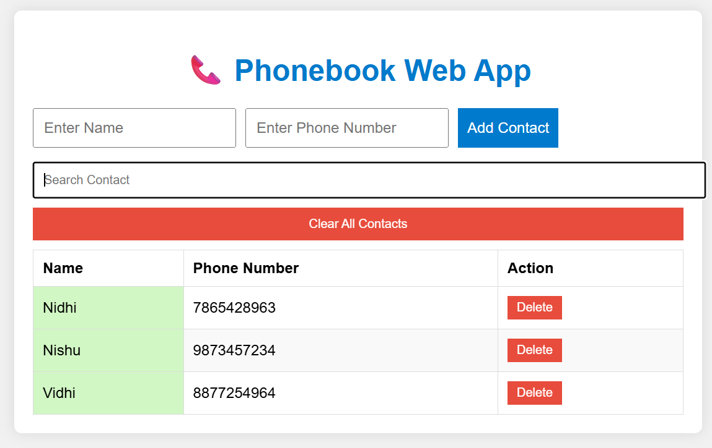

# 📞 Phonebook Project

This repository contains **two versions** of a Phonebook project:
1️⃣ **C++ Console App**  
2️⃣ **Web App (HTML/CSS/JS)**  

---

## 🟣 Phonebook C++ Console Version
✅ Built using C++  
✅ Allows adding, viewing, searching contacts  
✅ Uses file handling to store data in a text file  

**How to Run:**  
- Open `phonebook.cpp` in a C++ compiler (Turbo C++ / GCC / CodeBlocks / etc.)  
- Compile and run

---

## 🟣 Phonebook Web App Version
✅ Built using HTML, CSS, JavaScript  
✅ Add, view, search, delete, and clear contacts  
✅ Data saved in browser's localStorage  
✅ Works offline — no server required  

**How to Run:**  
- Open `index.html` in any browser  
- Explore the interactive phonebook

---

## 📸 Screenshot

---

## 👤 NIDHI KUSHWAHA  
[GitHub Profile](https://github.com/Nishuthaku)

---

## 📝 License
This project is open source and free to use.
